# iXland Architecture - Post Mission Documentation

**Version**: 1.0.0  
**Date**: 2026-03-28  
**Status**: Implementation Complete

---

## Table of Contents

1. [System Architecture Overview](#system-architecture-overview)
2. [Component Interaction Flows](#component-interaction-flows)
3. [Data Flow Diagrams](#data-flow-diagrams)
4. [Build System Structure](#build-system-structure)
5. [Header Organization](#header-organization)

---

## System Architecture Overview

### High-Level Architecture

```mermaid
flowchart TB
    subgraph App["iOS Application Layer"]
        SwiftUI["SwiftUI Terminal"]
        SessionMgr["Session Manager"]
        CmdDispatch["Command Dispatch"]
    end

    subgraph libc["ixland-libc (Public API)"]
        direction TB
        IoxH["iox/iox.h<br/>Umbrella Header"]
        Types["iox/iox_types.h<br/>Type Definitions"]
        Syscalls["iox/iox_syscalls.h<br/>Syscall Declarations"]
        Pwd["pwd.h<br/>User Database"]
        Grp["grp.h<br/>Group Database"]
    end

    subgraph System["ixland-system (Kernel Implementation)"]
        direction TB

        subgraph Core["Core Subsystems"]
            Init["iox_init.c<br/>Initialization"]
            Identity["iox_identity.c<br/>UID/GID Management"]
            Poll["iox_poll.c<br/>Poll/Select"]
        end

        subgraph Task["Task Subsystem"]
            TaskCore["task.c<br/>Task Lifecycle"]
            Fork["fork.c<br/>Fork/Vfork"]
            Exit["exit.c<br/>Process Exit"]
            Wait["wait.c<br/>Wait Syscalls"]
            Pid["pid.c<br/>PID Management"]
        end

        subgraph Signal["Signal Subsystem"]
            SigCore["signal.c<br/>Signal Handling"]
            SigQueue["Signal Queue"]
        end

        subgraph VFS["VFS Subsystem"]
            VfsCore["vfs.c<br/>Path Translation"]
            Fdtable["fdtable.c<br/>FD Management"]
            Path["iox_path.c<br/>Path Operations"]
        end

        subgraph Exec["Exec Subsystem"]
            ExecCore["exec.c<br/>Program Execution"]
            Image["Image Loading"]
        end

        subgraph WASI["WASI Runtime"]
            WamrAdapter["wasm_adapter.c<br/>WAMR Integration"]
            WamrSimple["iox_wamr_simple.c<br/>Simple WAMR"]
        end
    end

    subgraph Runtime["Runtime Backends"]
        Native["Native Execution"]
        WASIRuntime["WASI Runtime"]
        Script["Script Interpreter"]
    end

    App -->|@_cdecl("iox_*)"| libc
    libc -->|Internal Calls| System
    System -->|Execute| Runtime

    TaskCore -->|uses| Signal
    TaskCore -->|uses| VFS
    ExecCore -->|uses| Task
    WASI -->|uses| VFS

    style libc fill:#ccffcc
    style System fill:#ffcccc
    style Runtime fill:#ccccff
```

### Component Dependencies

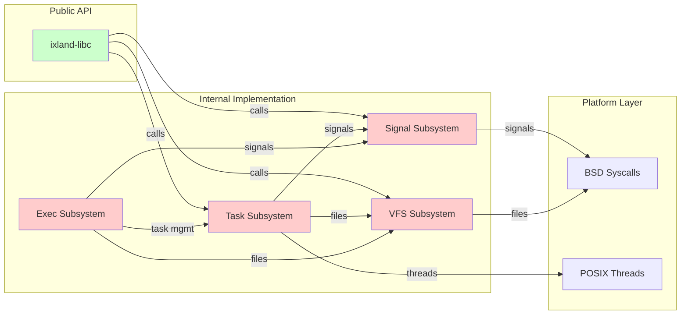

---

## Component Interaction Flows

### Process Creation Flow (fork/exec)

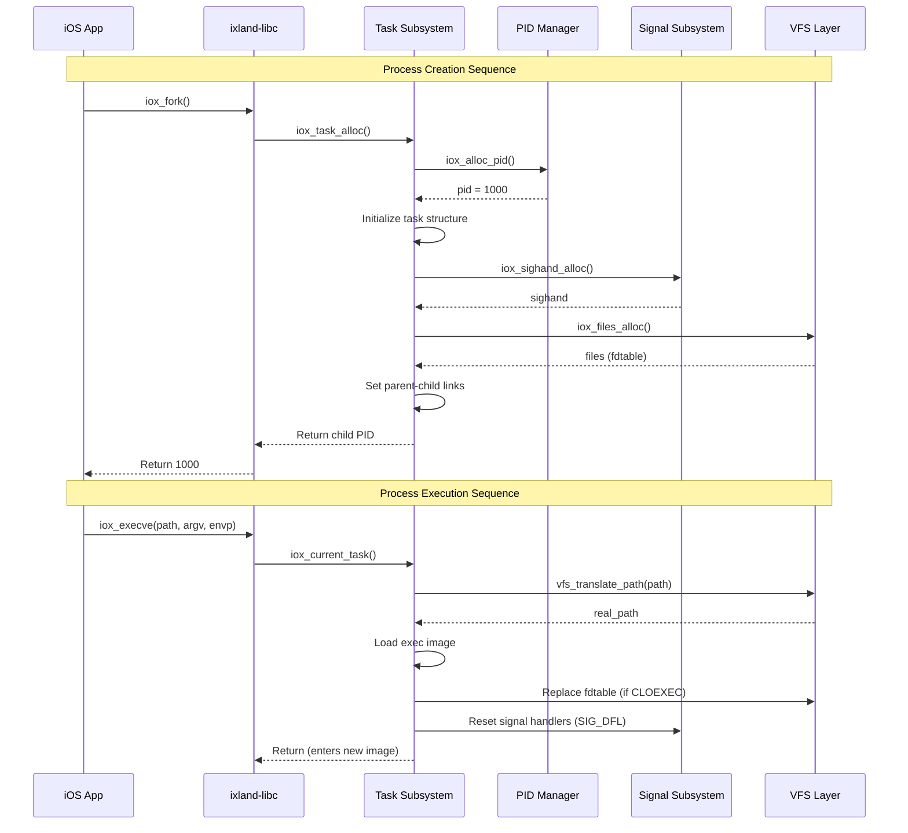

### Signal Delivery Flow

```mermaid
sequenceDiagram
    participant Sender as Sending Process
    participant Sig as Signal Handler
    recipient as Recipient Task
    Queue as Signal Queue
    Wait as Wait Queue

    Note over Sender,Wait: Signal Delivery Sequence

    Sender->>Sig: iox_kill(pid, SIGINT)
    Sig->>recipient: iox_task_lookup(pid)
    recipient-->>Sig: task

    Sig->>recipient: Check sigprocmask

    alt Signal Blocked
        Sig->>Queue: iox_sigqueue_entry_alloc()
        Queue->>recipient: Add to pending
        Sig-->>Sender: Return 0
    else Signal Not Blocked
        Sig->>recipient: Set signaled = true
        Sig->>recipient: termsig = SIGINT

        alt Process is Waiting
            Sig->>Wait: pthread_cond_broadcast()
        end

        Sig-->>Sender: Return 0
    end

    Note over Sender,Wait: Signal Handling

    recipient->>Sig: Process pending signals
    Sig->>Queue: Dequeue pending
    Sig->>recipient: Get sigaction

    alt SA_SIGINFO
        Sig->>recipient: Call sa_sigaction(sig, info, context)
    else Standard
        Sig->>recipient: Call sa_handler(sig)
    end
```

### Process Wait Flow (waitpid)

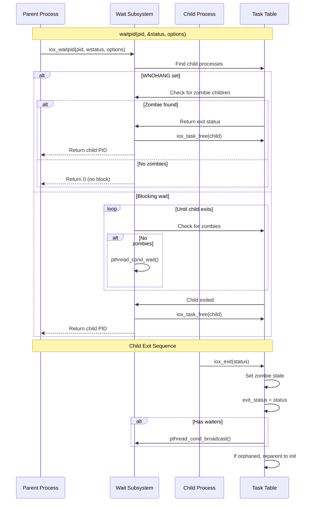

### File Operation Flow

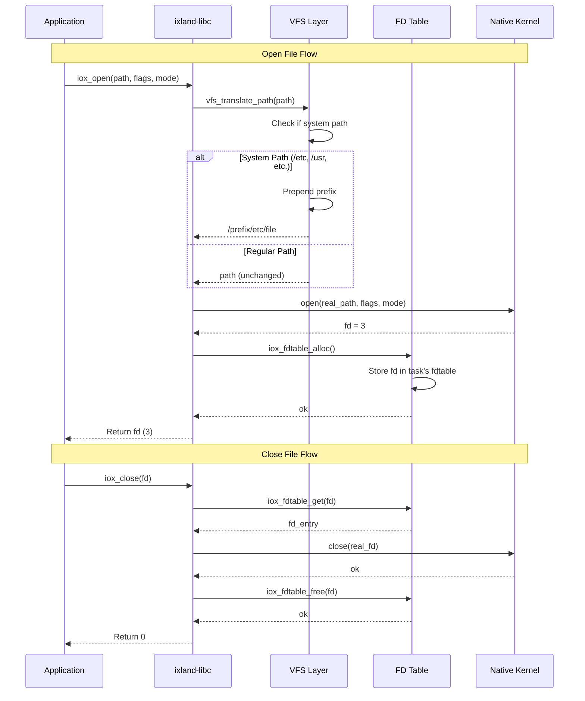

### Vfork Flow (Optimized Fork)

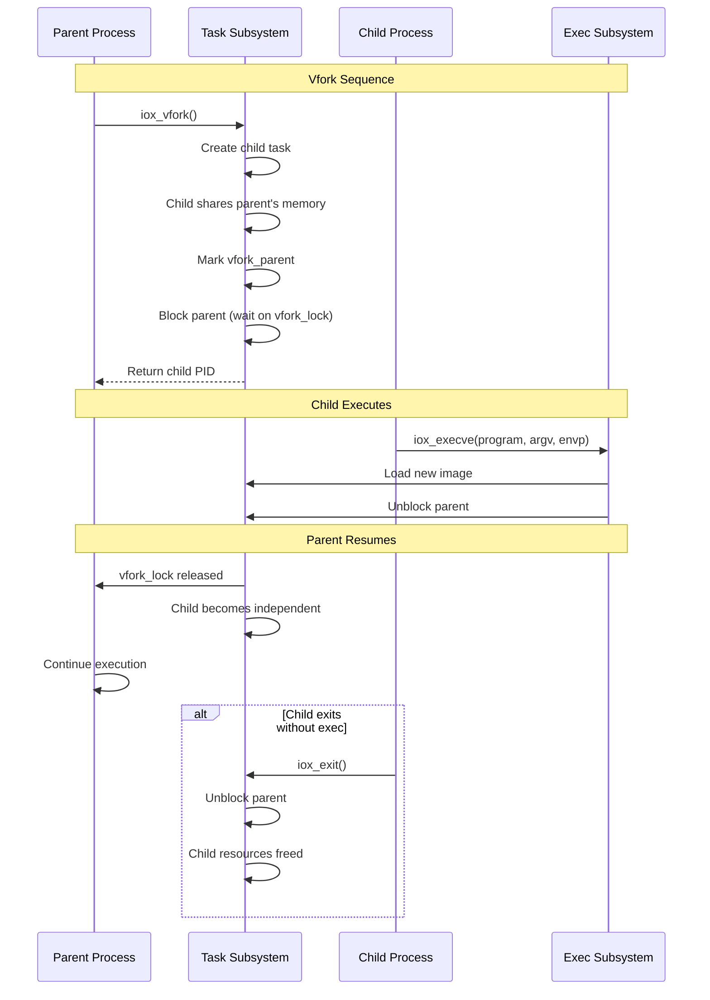

---

## Data Flow Diagrams

### Process State Transitions

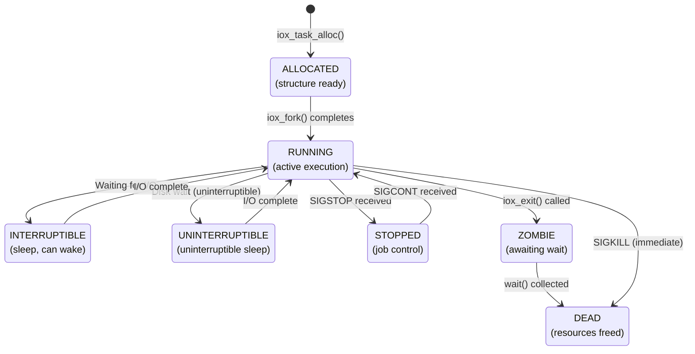

### Signal State Machine

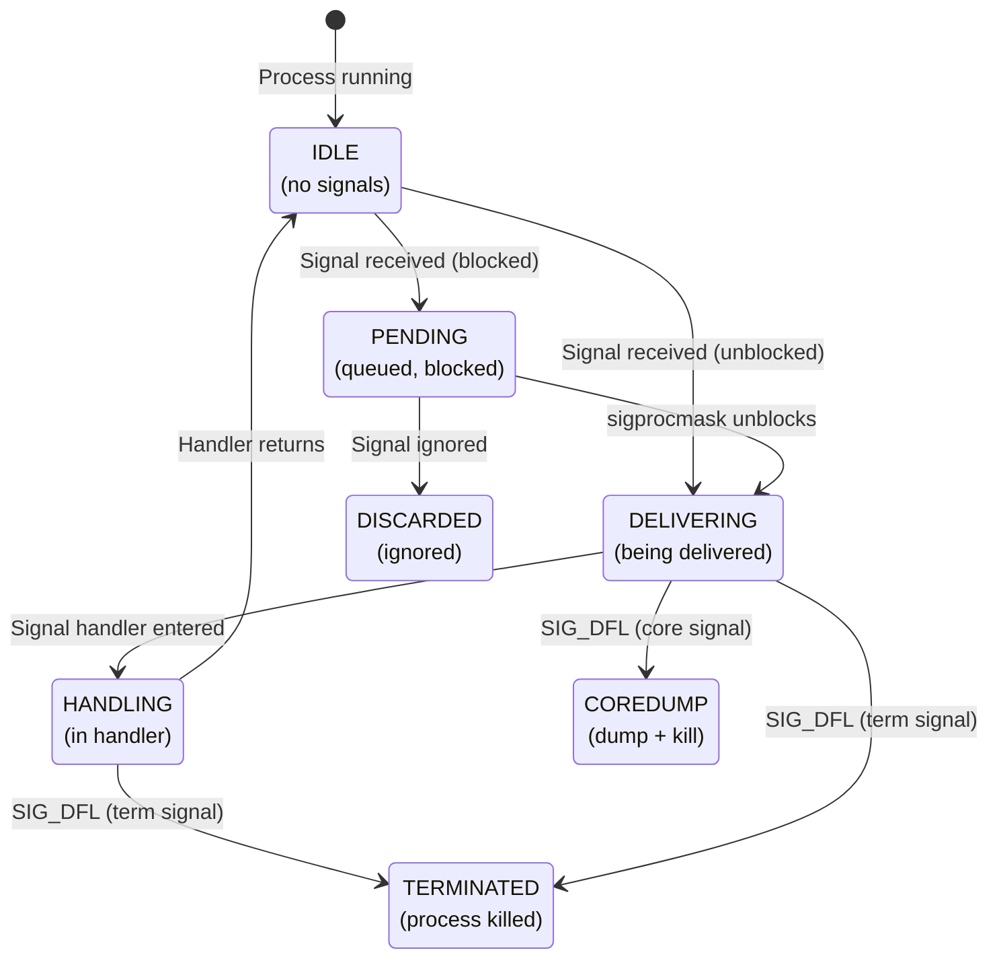

### Memory Management Flow

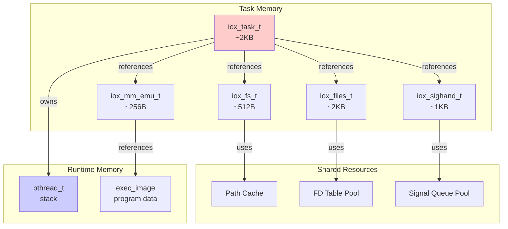

---

## Build System Structure

### CMake Build Flow

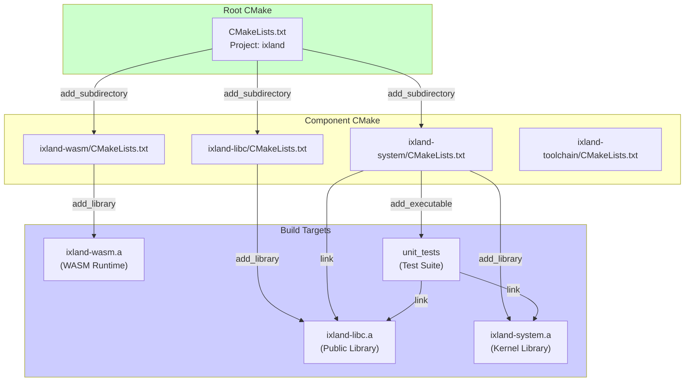

### Include Hierarchy

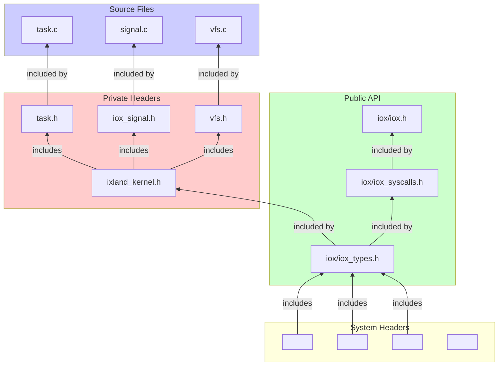

---

## Header Organization

### Header Dependency Graph

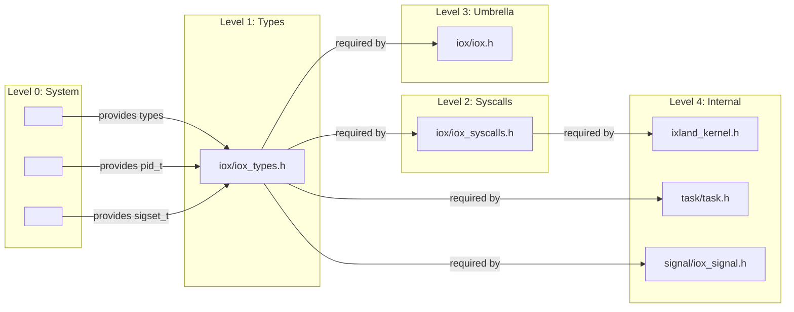

### Public API Surface

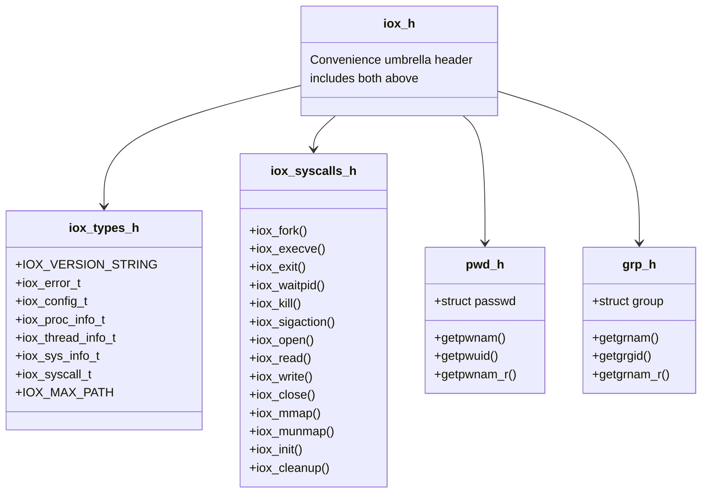

### Internal Header Relationships

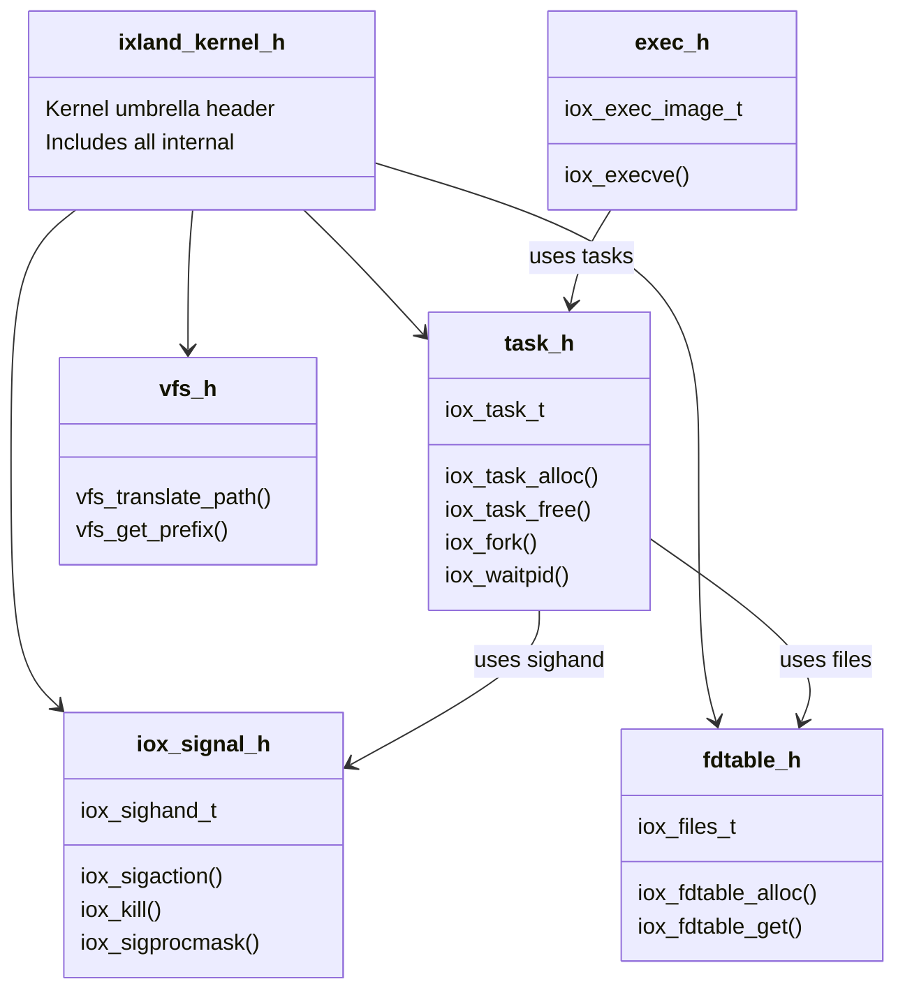

---

## Summary

This architecture documentation captures the complete post-mission state of the iXland kernel system:

1. **System Architecture**: Thread-based process simulation with virtual PIDs
2. **Component Interaction**: Clear flow diagrams for fork/exec, signals, and file operations
3. **Data Flow**: State machines and memory management visualization
4. **Build System**: CMake-based multi-component build
5. **Header Organization**: Clear separation between public and internal APIs

The architecture enables:
- **POSIX Compatibility**: Linux-compatible syscalls on iOS
- **Clean Boundaries**: Public API in ixland-libc, implementation in ixland-system
- **Extensibility**: WASI runtime integration ready
- **Testability**: Comprehensive test coverage with 213 assertions

---

*End of Architecture Documentation*
